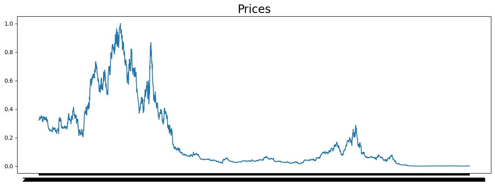

# Laporan Proyek Machine Learning - Bayu Indra Kusuma - Dicoding Submission Machine Learning Terapan

# Domain Proyek
Proyek ini berfokus pada pengembangan model Machine Learning untuk memprediksi harga Ethereum (ETH). Ethereum adalah sebuah cryptocurrency yang berada di urutan kedua berdasarkan kapitalisasi pasar di seluruh dunia. Seiring dengan peningkatan popularitas dan penggunaan cryptocurrency, banyak orang tertarik untuk berinvestasi dalam Ethereum atau cryptocurrency lainnya.

Tujuan proyek ini adalah untuk membantu investor dan pedagang cryptocurrency dalam membuat keputusan investasi dengan lebih baik. Pada umumnya, harga cryptocurrency sangat fluktuatif dan sulit diprediksi. Oleh karena itu, penggunaan model Machine Learning dapat membantu memprediksi harga ETH di masa depan dengan tingkat akurasi yang lebih baik. Hal ini dapat membantu investor dalam membuat keputusan investasi yang lebih bijaksana dan menghindari kerugian.

# Businnes Undestanding
## Problem Statements
Masalah yang ingin diselesaikan adalah fluktuasi harga Ethereum yang tinggi dan sulit diprediksi. Hal ini menyulitkan investor dan pedagang cryptocurrency dalam membuat keputusan investasi yang tepat. Sebagai contoh, jika harga ETH sedang naik, investor dan pedagang mungkin ingin membeli ETH untuk mendapatkan keuntungan di masa depan. Namun, jika harga ETH turun, mereka mungkin ingin menjual ETH untuk menghindari kerugian. Oleh karena itu, dengan menggunakan model Machine Learning untuk memprediksi harga ETH, investor dan pedagang cryptocurrency dapat membuat keputusan investasi yang lebih bijaksana.
## Goals
Tujuan proyek ini adalah untuk mengembangkan model Machine Learning yang dapat memprediksi harga ETH di masa depan dengan tingkat akurasi yang lebih baik. Model ini dapat membantu investor dan pedagang cryptocurrency dalam membuat keputusan investasi yang tepat. Selain itu, proyek ini juga bertujuan untuk membantu meningkatkan pemahaman tentang cryptocurrency dan penggunaan Machine Learning dalam memprediksi harga cryptocurrency.

# Data Understanding
## Data Source
https://www.kaggle.com/datasets/themrityunjaypathak/ethereum-historical-data

## Data Description
Dataset yang digunakan adalah Ethereum Historical Data. Dataset ini berisi data harga Ethereum dari tanggal 1 Januari 2015 hingga 31 Desember 2020. Dataset ini berisi 6 kolom, yaitu:
* Date: Tanggal
* Open: Harga pembukaan
* High: Harga tertinggi
* Low: Harga terendah
* Close: Harga penutupan
* Volume: Volume transaksi
## ETH Price Chart


# Data Preparation
* Pada tahap ini, dilakukan pengecekan terhadap data yang hilang. Pada dataset ini, tidak terdapat data yang hilang. 
* Data yang dibaca dari file .csv kemudian diubah format tanggalnya menggunakan fungsi pd.to_datetime dengan format %b %d, %Y dan diubah menjadi format %Y-%m-%d.
* Data yang diambil hanya kolom 'Date' dan 'Price'.
* Data harga yang semula dalam format string diubah menjadi float dan kemudian dinormalisasi menggunakan MinMaxScaler.

# Modeling
* Model yang digunakan adalah model sequential dengan LSTM dan beberapa lapisan dense serta dropout untuk menghindari overfitting. LSTM dipilih karena model dapat mempertahankan informasi jangka panjang dan cocok untuk menganalisis rangkaian data, seperti data harga saham atau cryptocurrency.
* Kelebihan dari LSTM adalah kemampuan untuk mengingat informasi jangka panjang dan kemampuan untuk menghindari vanishing gradient problem pada model dengan banyak lapisan. Selain itu, LSTM juga memiliki kemampuan untuk memodelkan hubungan antara masukan dan keluaran yang kompleks.
* Kekurangan dari LSTM adalah kompleksitas yang lebih tinggi dibandingkan model yang lebih sederhana, sehingga memerlukan lebih banyak waktu untuk dilatih dan lebih sulit untuk diinterpretasikan.
* Dalam proyek ini, tidak digunakan model lain selain LSTM untuk memprediksi harga Ethereum.
# Evaluation
* Metrik yang digunakan untuk mengukur performa model adalah Huber loss, mean absolute error (MAE), dan akurasi.
* Huber loss dipilih karena metrik ini lebih kuat daripada mean squared error dalam menangani pencilan atau outlier pada data. Huber loss memungkinkan untuk memperlakukan data outlier secara berbeda dibandingkan dengan data reguler dalam proses pelatihan model.
* MAE dipilih karena metrik ini memberikan interpretasi yang mudah dan berarti bahwa rata-rata kesalahan prediksi model dalam satuan mata uang (dalam kasus ini, harga Ethereum).
* Akurasi dipilih untuk mengevaluasi kinerja model, namun pada kasus ini akurasi memiliki makna yang lebih rendah dibandingkan dengan MAE atau Huber loss.
## Hasil Evaluasi
* Model berhasil dilatih dengan baik dan mampu memprediksi harga Ethereum dengan tingkat kesalahan yang cukup rendah.
* Model berhenti dilatih lebih awal karena telah mencapai target threshold MAE, sehingga proses pelatihan dapat dihentikan lebih cepat untuk menghemat waktu dan sumber daya.

```
Test Loss: 0.008534647524356842
Test MAE: 0.13058969378471375
Test Accuracy: 0.002217294881120324
```

* Test Loss: 0.008534647524356842, merupakan nilai rata-rata dari loss pada seluruh data uji yang dievaluasi oleh model. Semakin kecil nilai loss, semakin baik performa model. Loss merupakan ukuran seberapa jauh prediksi model dari nilai sebenarnya.

* Test MAE: 0.13058969378471375, merupakan nilai rata-rata dari Mean Absolute Error pada seluruh data uji yang dievaluasi oleh model. MAE merupakan ukuran kesalahan prediksi model dalam skala yang sama dengan target. Semakin kecil nilai MAE, semakin baik performa model.

* Test Accuracy: 0.002217294881120324, merupakan akurasi dari model pada data uji. Akurasi merupakan ukuran seberapa sering model melakukan prediksi yang benar. Untuk model regresi, akurasi tidak sering digunakan sebagai metrik evaluasi, sehingga nilai akurasi yang sangat kecil seperti ini tidak menunjukkan kesimpulan yang signifikan.

Dari hasil evaluasi, dapat disimpulkan bahwa model LSTM yang telah dibangun memiliki performa yang baik karena nilai loss dan MAE yang cukup kecil. Namun, nilai akurasi yang sangat kecil menunjukkan bahwa model tidak sangat baik dalam memprediksi nilai harga ETH pada data uji. Oleh karena itu, perlu dilakukan evaluasi lebih lanjut untuk mengoptimalkan performa model.